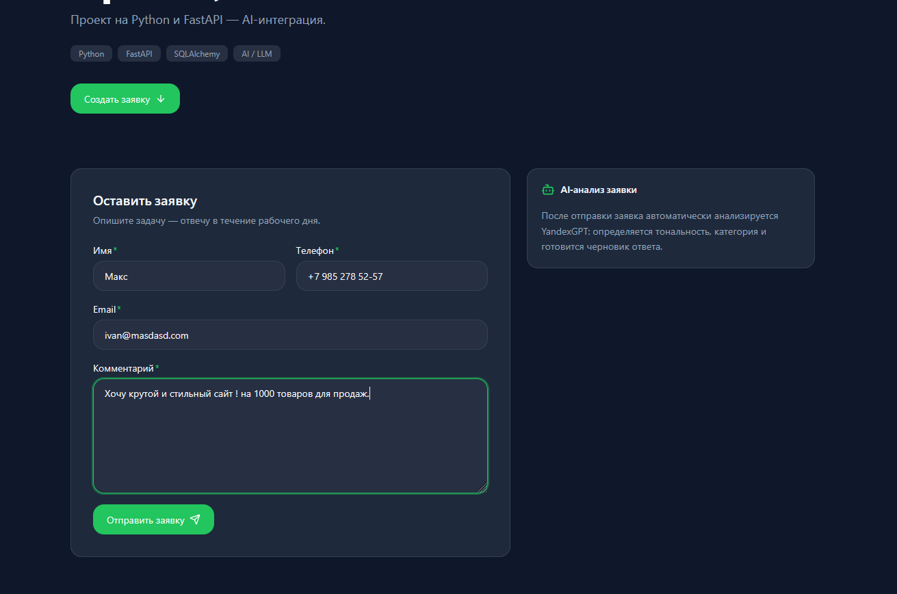
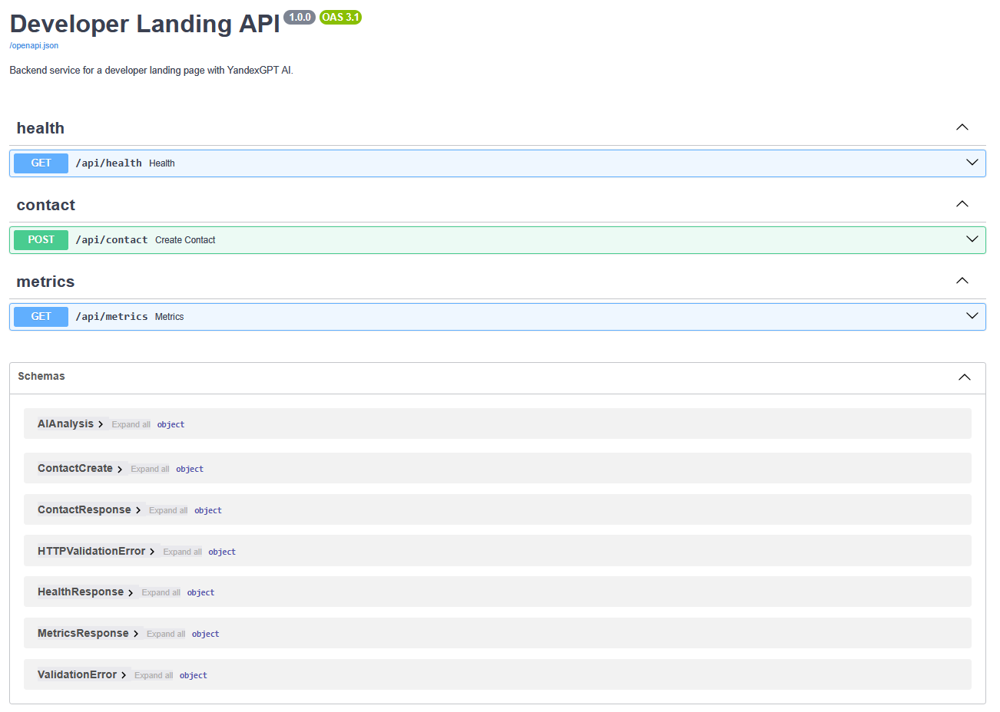
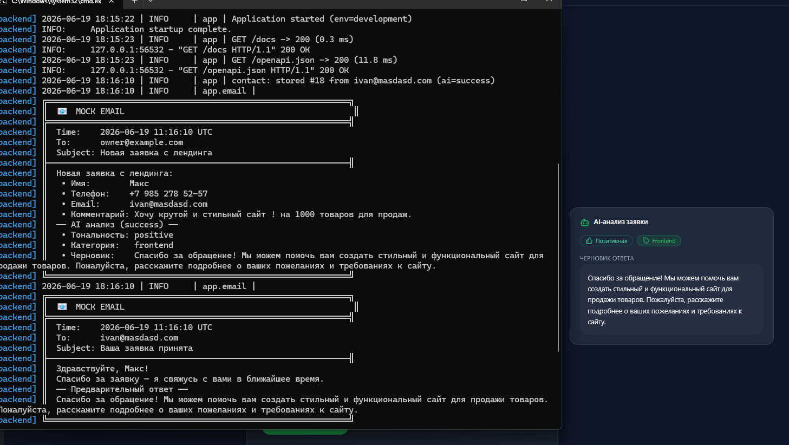
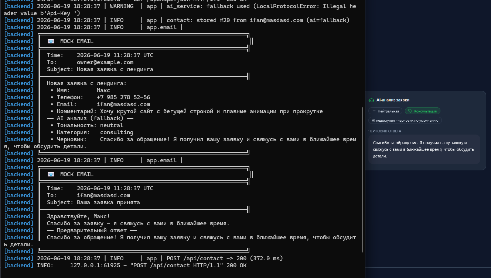
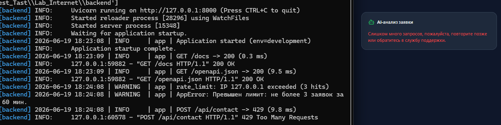

<div align="center">

# InternetLab

### Landing с AI-анализом заявок

Форма обратной связи на React с backend на FastAPI: заявка валидируется, анализируется через YandexGPT, сохраняется в SQLite и отправляется в mock-email.


</div>

## Возможности

- AI-анализ заявки: тональность, категория и черновик ответа.
- Graceful fallback: недоступность YandexGPT не прерывает обработку заявки.
- Персистентный rate limit по IP для отправок из веб-формы.
- Хранение заявок и результата AI в SQLite.
- Mock-email владельцу и пользователю с записью в файл.
- Swagger UI, health-check и метрики обработки.

## Стек

| Часть    | Технологии                                                                       |
| -------- | -------------------------------------------------------------------------------- |
| Backend  | Python 3.10+, FastAPI, Pydantic 2, SQLAlchemy 2 async, aiosqlite, httpx, Uvicorn |
| Frontend | React 18, TypeScript, Vite 6, Tailwind CSS, React Hook Form, Zod, Lucide React   |
| AI       | Yandex Cloud Foundation Models / YandexGPT                                       |
| Данные   | SQLite, JSON-хранилище rate limit, rotating logs                                 |

## Быстрый запуск

### Требования

- Python 3.10 или новее;
- Node.js 18 или новее и npm;
- Windows для запуска через `start-dev.cmd`.

### 1. Установить зависимости

```powershell
# Backend
cd backend
python -m venv .venv
.\.venv\Scripts\python.exe -m pip install -r requirements.txt

# Frontend
cd ..\frontend
npm install
cd ..
```

Файл `backend/.env` уже находится в проекте. Перед запуском проверьте значения `YANDEX_FOLDER_ID` и `YANDEX_API_KEY`.

### 2. Запустить frontend и backend

Из корня проекта:

```powershell
.\start-dev.cmd
```

Скрипт освобождает порты `8000` и `5173`, затем запускает оба сервиса параллельно. Остановка — `Ctrl+C`.

<details>
<summary>Запуск сервисов раздельно</summary>

Backend:

```powershell
cd backend
.\.venv\Scripts\Activate.ps1
python -m uvicorn app.main:app --reload --port 8000
```

Frontend во втором терминале:

```powershell
cd frontend
npm run dev:frontend
```

</details>

### Адреса после запуска

| Сервис       | URL                                  |
| ------------ | ------------------------------------ |
| Frontend     | <http://localhost:5173>              |
| Backend API  | <http://localhost:8000>              |
| Swagger UI   | <http://localhost:8000/docs>         |
| OpenAPI JSON | <http://localhost:8000/openapi.json> |

## Структура проекта

### Frontend

```text
frontend/
├── src/
│   ├── components/      # Переиспользуемые UI-компоненты
│   ├── features/        # Крупные блоки страницы и формы
│   ├── hooks/           # Логика формы и темы
│   ├── lib/             # Zod-схема и вспомогательные функции
│   ├── services/        # HTTP-клиент для backend API
│   ├── types/           # TypeScript-типы приложения
│   ├── utils/           # Форматирование телефона
│   ├── App.tsx          # Корневой компонент
│   ├── index.css        # Глобальные стили и Tailwind
│   └── main.tsx         # Точка входа React
├── index.html           # HTML-шаблон Vite
├── package.json         # Зависимости и npm-скрипты
├── tailwind.config.js   # Настройка Tailwind CSS
├── tsconfig.json        # Настройка TypeScript
└── vite.config.ts       # Vite и proxy /api → backend
```

### Backend

```text
backend/
├── app/
│   ├── api/             # Маршруты contact, health и metrics
│   ├── core/            # Конфигурация, middleware, логи и ошибки
│   ├── db/              # Async SQLAlchemy engine и сессии
│   ├── models/          # ORM-модели SQLite
│   ├── repositories/    # Работа с данными
│   ├── schemas/         # Pydantic-схемы запросов и ответов
│   ├── services/        # AI, email, rate limit и обработка заявок
│   └── main.py          # Точка входа FastAPI
├── data/                # SQLite и состояние rate limit
├── logs/                # Логи приложения и mock-email
├── .env                 # Переменные окружения
└── requirements.txt     # Python-зависимости
```

## API

### `POST /api/contact`

Создаёт заявку. Обязательные поля: `name`, `phone`, `email`, `comment`.

```bash
curl -X POST "http://localhost:8000/api/contact" \
  -H "Content-Type: application/json" \
  -d '{
    "name": "Макс",
    "phone": "+7 985 278-52-57",
    "email": "ivan@example.com",
    "comment": "Нужен современный сайт для каталога товаров"
  }'
```

#### `200 OK` — YandexGPT ответил

```json
{
	"id": 18,
	"name": "Макс",
	"email": "ivan@example.com",
	"created_at": "2026-06-19T11:16:10",
	"ai": {
		"sentiment": "positive",
		"category": "frontend",
		"draft_reply": "Спасибо за обращение! Расскажите подробнее о каталоге и требованиях к сайту.",
		"status": "success"
	},
	"message": "Заявка принята. Спасибо!"
}
```

#### `200 OK` — AI fallback

При ошибке или тайм-ауте YandexGPT заявка всё равно сохраняется, а API возвращает безопасный ответ по умолчанию.

```json
{
	"id": 20,
	"name": "Макс",
	"email": "ivan@example.com",
	"created_at": "2026-06-19T11:28:37",
	"ai": {
		"sentiment": "neutral",
		"category": "consulting",
		"draft_reply": "Спасибо за обращение! Я получил вашу заявку и свяжусь с вами в ближайшее время, чтобы обсудить детали.",
		"status": "fallback"
	},
	"message": "Заявка принята. Спасибо!"
}
```

Возможные значения AI-полей:

| Поле        | Значения                                      |
| ----------- | --------------------------------------------- |
| `sentiment` | `positive`, `negative`, `neutral`             |
| `category`  | `frontend`, `backend`, `design`, `consulting` |
| `status`    | `success`, `fallback`                         |

#### `422 Unprocessable Entity` — ошибка валидации

```json
{
	"detail": "name: String should have at least 2 characters"
}
```

Ограничения входных данных:

| Поле      | Правила                                                 |
| --------- | ------------------------------------------------------- |
| `name`    | от 2 до 120 символов, не пустая строка                  |
| `phone`   | от 7 до 40 символов; цифры, пробелы, `+`, `-`, `(`, `)` |
| `email`   | валидный email                                          |
| `comment` | от 5 до 2000 символов, не пустая строка                 |

#### `429 Too Many Requests` — превышен лимит

Rate limit применяется только к запросам веб-формы с заголовком `X-Contact-Source: web-form`. По умолчанию разрешено 3 заявки за 60 минут с одного IP; четвёртая вернёт `429`.

```bash
curl -X POST "http://localhost:8000/api/contact" \
  -H "Content-Type: application/json" \
  -H "X-Contact-Source: web-form" \
  -d '{
    "name": "Макс",
    "phone": "+7 985 278-52-57",
    "email": "ivan@example.com",
    "comment": "Повторная заявка для проверки ограничения"
  }'
```

```json
{
	"detail": "Превышен лимит: не более 3 заявок за 60 мин."
}
```

Запросы из Swagger и `curl` без заголовка `X-Contact-Source` лимитом не ограничиваются. Состояние хранится в `backend/data/rate_limits.json` и сохраняется между перезапусками.

### `GET /api/health`

```bash
curl "http://localhost:8000/api/health"
```

```json
{
	"status": "ok",
	"env": "development"
}
```

### `GET /api/metrics`

```bash
curl "http://localhost:8000/api/metrics"
```

```json
{
	"total_requests": 20,
	"ai_success": 19,
	"ai_fallback": 1
}
```

## Интерфейс и сценарии

### Стартовая страница



### Swagger UI



### Успешный AI-анализ

YandexGPT вернул структурированный результат; backend сохранил заявку и сформировал два mock-email.



### Graceful fallback

AI недоступен, но заявка обработана с `status: fallback` и ответом по умолчанию.



### Rate limit

После исчерпания лимита в 3 запроса, frontend показывает ошибку, а backend отвечает HTTP `429`.



## Архитектура и важные детали

```text
React form
    ↓ POST /api/contact
FastAPI route
    ↓
RateLimitService → AIService → ContactRepository → EmailService
                         ↓              ↓               ↓
                    YandexGPT        SQLite        console + log
```

- Backend разделён на слои `api → service → repository → model`.
- `AIService` ограничивает запрос тайм-аутом и перехватывает ошибки, возвращая `status="fallback"`.
- `EmailService` использует Strategy pattern: в development работает `MockEmailSender`; SMTP оставлен как production-заготовка.
- Заявки сохраняются в `backend/data/app.db`.
- Логи приложения и mock-email находятся в `backend/logs/app.log` и `backend/logs/emails.log`.
- Vite проксирует frontend-запросы `/api` на `http://localhost:8000`.

## Переменные окружения

Конфигурация читается из `backend/.env`:

| Переменная                  | Назначение                             |
| --------------------------- | -------------------------------------- |
| `YANDEX_FOLDER_ID`          | ID каталога Yandex Cloud               |
| `YANDEX_API_KEY`            | API-ключ Yandex Cloud                  |
| `YANDEX_GPT_MODEL_URI`      | Модель YandexGPT                       |
| `APP_ENV`                   | Окружение приложения                   |
| `RATE_LIMIT_MAX_REQUESTS`   | Максимум заявок в окне                 |
| `RATE_LIMIT_WINDOW_MINUTES` | Размер окна rate limit в минутах       |
| `EMAIL_MOCK_MODE`           | Использование mock-email               |
| `CORS_ORIGINS`              | Разрешённые origins через запятую      |
| `OWNER_EMAIL`               | Получатель уведомлений о новых заявках |
